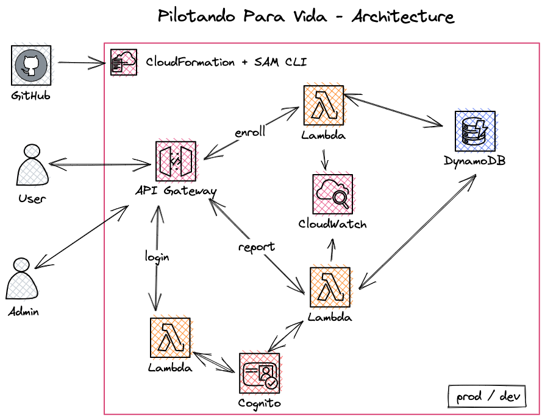

# Project Pilotando Para Vida - API

 

## Architecture

## Swagger

## Manual Steps

After implementation or update follow this manual steps to conclude:

1. Update .env with [README.md](node-js/README.md)
    1. Open CloudFormation on AWS console and get physical ID of `DevCognitoUserPool` and `ClientDevCognitoUserPool`.
1. Update the example inside `create_user.js` with some test user.
1. Run `npm run create_user`.
    1. Open `DevCognitoUserPool` on AWS console.
        1. Select Users and find the user created.
        1. Open the user and in `Actions` select `Confirm account`.
    1. Open `DevCognitoUserPool` on AWS console.
        1. Select `Application Integration`
        1. Select `client_dev`.
        1. Edit and add `ALLOW_USER_PASSWORD_AUTH` on `Authentication Flow`.
        1. Save.
1. Open [ppv-form vercel](https://vercel.com/cavalodeaco/ppv-form/settings/environment-variables)
    1. Change the `REACT_APP_BACKEND_ADDRESS` of Dev and preview with the `ApiGatewayDevApi` physical ID (get on CloudFormation).
    1. Re-deploy development ppv-form.
1. Open [ppv-admin vercel](https://vercel.com/cavalodeaco/ppv-admin/settings/environment-variables)
    1. Change the `REACT_APP_BACKEND_ADDRESS` of Dev and preview with the `ApiGatewayDevApi` physical ID (get on CloudFormation).
    1. Re-deploy development ppv-admin.
1. On development env, insert fake data for testing.
    1. Add `DEV_AWS_API_GATEWAY_URL` with the development URL of ApiGateway
    1. Run `npm run create_fake`